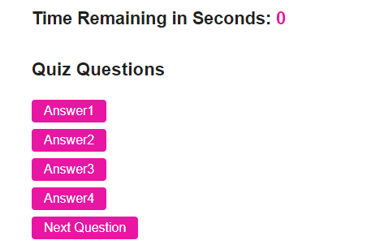

# WebAPIsCodeQuiz
Homework #4

## Description

This is a timed quiz with multiple-choice questions on coding. The app runs in the browser and features HTML and CSS powered by JavaScript. The screen is dynamic and adjusts to window size.

- Quiz focuses on JavaScript fundamentals
- Features high scores recorded by user 
- User has 60 seconds to take the quiz
- 10 seconds are deducted for each incorrect answer

## Usage

To use this browser, initially click "Start Button" to begin coding quiz. Within 60 seconds, user needs to answer all five questions correctly in order not to lose seconds on the countdown timer.

Screenshot: Image from HTML pages that features button options with pink formatting
    

## Links

Link to GitHub Page: https://deven1991.github.io/WebAPIsCodeQuiz/