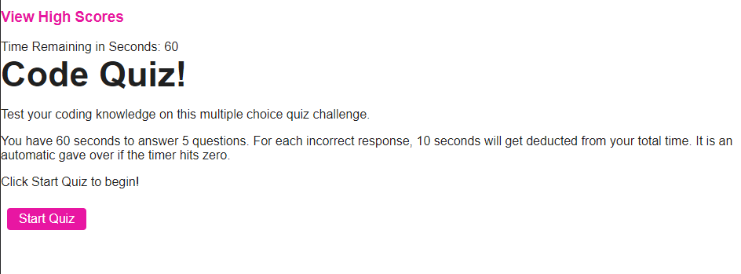
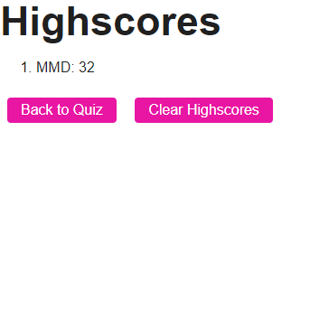

# WebAPIsCodeQuiz

## Description

This is a timed quiz with multiple-choice questions on coding. The app runs in the browser and features HTML and CSS powered by JavaScript. The screen is dynamic and adjusts to window size.

- Quiz focuses on JavaScript fundamentals
- Features high scores recorded by user
- User has 60 seconds to take the quiz
- 10 seconds are deducted for each incorrect answer

## Table of Contents 

- [Installation](#installation)
- [Usage](#usage)
- [Links](#Links)

## Installation

The web page consists of two separate HTML pages - one for landing page and second for high scores. Additionally, the web page contains two script files - one for questions and second for high scores. The style page includes formatting to provide a pink theme.

## Usage

To use this browser, initially click "Start Button" to begin coding quiz. Within 60 seconds, user needs to answer all five questions correctly in order not to lose seconds on the countdown timer.
    

Once the user is done taking the quiz, they are prompted to enter initials for high scores web page.
    

## Links

Link to GitHub Page: https://deven1991.github.io/WebAPIsCodeQuiz/
Repo: https://github.com
